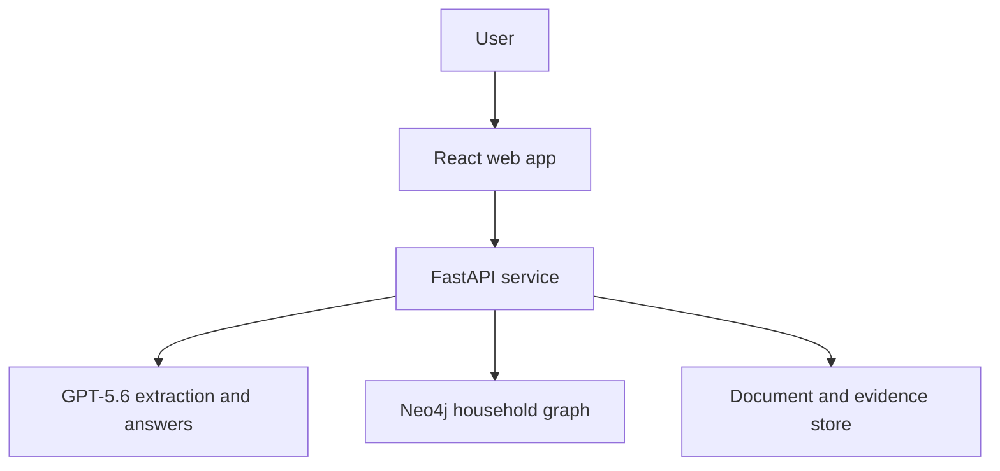

# HomeGraph

HomeGraph turns scattered household documents into a connected, explainable map of possessions, warranties, insurance policies, subscriptions, providers, payments, and deadlines.

Built for the **OpenAI Build Week** hackathon in the **Apps for Your Life** category.

## The problem

Important household information is usually fragmented across receipts, warranty PDFs, insurance documents, recurring bills, email attachments, and online accounts. This makes simple questions unexpectedly difficult:

- Is this device still under warranty?
- Is it covered by an insurance policy?
- What proof would I need to file a claim?
- Which subscriptions use a particular payment method?
- What renewals or expirations require attention soon?

Traditional document search can find keywords, but it does not reliably connect the same product, provider, policy, payment, and deadline across multiple documents.

## The solution

HomeGraph uses GPT-5.6 to extract structured facts and relationships from household documents. The application validates those facts, stores them in Neo4j with source provenance, and provides grounded answers using controlled graph-retrieval tools.

Every answer is designed to show:

1. A direct response to the user's question.
2. The graph path used to reach the answer.
3. The source document and excerpt supporting each important claim.
4. Confidence or missing information when the available evidence is incomplete.

## Demo scenario

The repository includes a fictional household and synthetic documents so judges can test the complete experience without uploading private information.

The primary demo flow is:

1. Load or reset the sample household.
2. Upload a receipt, warranty, insurance summary, or recurring bill.
3. Review the entities and relationships extracted from the document.
4. Save the validated facts to the household knowledge graph.
5. Ask one of the golden questions.
6. Inspect the answer, relevant graph path, and cited evidence.

### Golden questions

- Which warranties expire in the next 90 days?
- Is the sample laptop covered, and what documents would be needed to file a claim?
- Which recurring payments use the sample household's primary credit card?
- What household deadlines require attention this month?

## MVP scope

### Included

- Text-based PDF and plain-text document ingestion.
- GPT-5.6 structured extraction.
- Schema validation before graph writes.
- Parameterized, idempotent Neo4j upserts.
- Source-document provenance for extracted facts.
- Controlled GraphRAG retrieval tools.
- Answers with supporting graph paths and evidence.
- Interactive household graph visualization.
- Deadline and evidence views.
- Synthetic sample documents and one-click demo reset.
- A judge-accessible deployment.

### Explicitly out of scope for the hackathon

- Email or cloud-drive integrations.
- OCR for scanned documents.
- Multi-user collaboration and production authentication.
- Automatic financial transactions or insurance claims.
- A universal ontology for every kind of household document.
- Fully autonomous Cypher generation against unrestricted data.

## Architecture



GPT-5.6 interprets documents and explains retrieved facts. Deterministic application code remains responsible for validation, identity keys, dates, graph writes, retrieval boundaries, and evidence linking.

## Initial graph model

| Node | Purpose | Example relationships |
| --- | --- | --- |
| `Household` | Root boundary for the demo data | `HAS_MEMBER`, `OWNS`, `USES_SERVICE` |
| `Person` | Household member | `MEMBER_OF`, `PURCHASED`, `HOLDS_POLICY` |
| `Product` | Owned household item | `PURCHASED_FROM`, `HAS_WARRANTY`, `COVERED_BY` |
| `Provider` | Merchant, insurer, utility, or service provider | `ISSUED`, `BILLS`, `PROVIDES` |
| `Warranty` | Product protection and expiration terms | `COVERS`, `ISSUED_BY`, `SUPPORTED_BY` |
| `Policy` | Insurance coverage | `COVERS`, `HELD_BY`, `SUPPORTED_BY` |
| `Subscription` | Recurring service or household bill | `PROVIDED_BY`, `PAID_WITH`, `SUPPORTED_BY` |
| `PaymentMethod` | Redacted card or account reference | `PAYS_FOR`, `SUPPORTED_BY` |
| `Deadline` | Renewal, expiration, cancellation, or action date | `APPLIES_TO`, `SUPPORTED_BY` |
| `Document` | Source and provenance record | `MENTIONS`, `SUPPORTS` |
| `Evidence` | Exact excerpt supporting an extracted fact | `FROM_DOCUMENT`, `SUPPORTS` |

The schema is intentionally small. New labels or relationships should only be added when required by a golden question.

## Proposed technology stack

- **Frontend:** React, TypeScript, Vite, Cytoscape.js
- **Backend:** Python, FastAPI, Pydantic
- **Graph database:** Neo4j 5.x
- **AI:** OpenAI API with GPT-5.6 structured outputs and tool calling
- **Document parsing:** pypdf and plain-text extraction
- **Local development:** Docker Compose
- **Testing:** pytest, Vitest, and a fixed golden-question evaluation set

## Repository structure

```text
homegraph/
├── apps/
│   ├── api/                 # FastAPI application
│   └── web/                 # React application
├── packages/
│   └── schemas/             # Shared extraction and API contracts
├── data/
│   └── samples/             # Synthetic judge-safe documents
├── database/
│   ├── constraints.cypher
│   ├── seed.cypher
│   └── queries/
├── docs/
│   ├── architecture.md
│   ├── graph-model.md
│   └── hackathon-development.md
├── tests/
│   └── evaluations/
├── .env.example
├── compose.yaml
└── README.md
```

## Getting started

### Prerequisites

- Docker and Docker Compose
- An OpenAI API key with access to GPT-5.6
- Git

### Run locally

```bash
git clone <repository-url>
cd homegraph
cp .env.example .env
# Add OPENAI_API_KEY to .env
docker compose up --build
```

Expected local services:

- Web application: `http://localhost:5173`
- API documentation: `http://localhost:8000/docs`
- Neo4j Browser: `http://localhost:7474`

These commands and ports are the intended development contract and should be updated if implementation choices change.

## Environment variables

```dotenv
OPENAI_API_KEY=
OPENAI_MODEL=gpt-5.6
NEO4J_URI=bolt://neo4j:7687
NEO4J_USERNAME=neo4j
NEO4J_PASSWORD=change-me
DOCUMENT_STORAGE_PATH=/data/documents
DEMO_MODE=true
```

Never commit a populated `.env` file, real household documents, credentials, or unredacted payment information.

## AI and graph safety boundaries

- Model output must pass Pydantic validation before persistence.
- Graph writes must use parameterized application-owned Cypher.
- The model must not receive unrestricted write access to Neo4j.
- Answers must be grounded in retrieved nodes, relationships, and evidence.
- Unsupported claims should be labeled as unknown instead of inferred as fact.
- Uploaded documents must be treated as untrusted input.
- Demo data must be synthetic and contain no real account numbers or personal information.

## Testing strategy

The MVP is considered reliable when it passes:

- Schema-validation tests for each supported document type.
- Idempotency tests proving that reprocessing a document does not duplicate facts.
- Provenance tests proving that displayed claims link to evidence.
- Golden-question evaluations with expected graph paths and key facts.
- An end-to-end demo test from reset through answer generation.

## How Codex and GPT-5.6 are used

### Codex

Codex is used during Build Week to design the architecture, implement the application, generate tests, review code, diagnose failures, and prepare the deployment. Development evidence will be maintained in `docs/hackathon-development.md`, dated commits, and the submitted `/feedback` session ID.

### GPT-5.6

GPT-5.6 is part of the running product. It converts document text into validated extraction proposals, selects controlled graph-retrieval tools for user questions, and turns retrieved graph facts into evidence-backed explanations.

## Definition of done

HomeGraph is submission-ready when a judge can:

- Open the hosted application without developer assistance.
- Load the fictional sample household.
- Process at least three supported document types.
- Ask all four golden questions successfully.
- See the graph path and evidence behind each answer.
- Reset the demo and repeat the flow.
- Follow the README to run the project locally.

## Hackathon submission checklist

- [ ] Working project available to judges at no charge.
- [ ] Category set to **Apps for Your Life**.
- [ ] Public repository, or private access granted to the required judging addresses.
- [ ] README includes setup, sample data, testing instructions, and Codex/GPT-5.6 usage.
- [ ] Public YouTube demo is under three minutes.
- [ ] Demo audio explains the product, Codex usage, and GPT-5.6 usage.
- [ ] `/feedback` Codex Session ID is included in the submission.
- [ ] All required Devpost fields are complete.
- [ ] Submission is not left in draft status.

## Status

HomeGraph is currently in hackathon MVP development. See `GITHUB_PROJECT_TICKETS.md` for the ordered implementation backlog.
